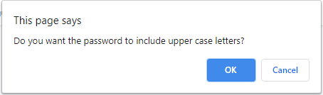
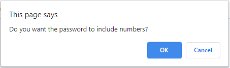

# Random Password Generator

<a href="https://mephestomd.github.io/password-generator/">Random Password Generator</a>

*A random password generator with user-defined criteria*

## Goal

To create a user-friendly, easily accessible password generator designed to be adaptable to a wide range of potential password requirements which can be defined easily by the user.

## Purpose

As the danger of cybercrime becomes more and more prevalent in today's increasingly web-based world, the need for secure passwords is ever-present. With a simple password generator such as this one, anyone will be able to generate secure passwords applicable to any website depending on the demands of that site's password criteria.

## Method

Using simple javascript commands such as **prompt**, **alert**, and **confirm** along with an event listener tied to a prominent **button**, an easy-to-understand user-interface was developed to allow anyone to generate a secure password with user-definied criteria. The generation of the password was handled using a **for** loop and array manipulation, with the core function returning a **string** containing the the password with the user-defined criteria.

## Usage

The user is initially presented with the following page:

Upon clicking the "Generate Password" button, the user is presented with a series of pop-up prompts, beginning with the prompt to specify the number of characters needed for the password:

If the user enters a number of characters outside the acceptable range (8-128), the application will alert the user of the character range requirement and again give the user an opportunity to enter the number of desired characters. This will continue until an approriate number of characters is entered.

Next, the user is presented with a series of prompts to determine what specific character criteria are needed for the password, including uppercase, lowercase, numbers, and special characters to be included or excluded from the password:

If the user fails to select for *any* of the criteria, an alert will appear letting the user know that they must select at least one criteria:

After all the relevant criteria are entered, the code will generate a random password and it will appear in the box above the button:

## Credits

<ul>
<li>
Valerie Flores - Mentor and tutor || <a href="https://github.com/valeriemiller5">Github</a>
</li>

<li>
Guillermo Barila - General support || <a href="https://github.com/gui365">Github</a>
</li>

<li>
Samuel Maddox - Javascript methods || <a href="https://github.com/SamuelMaddox">Github</a>
</li>

<li>
Javascript methods || <a href="https://developer.mozilla.org/en-US/docs/Web/JavaScript/Reference">MDN</a>
</li>   
</ul>

## License

MIT License

Copyright (c) 2021 Maxson Green

Permission is hereby granted, free of charge, to any person obtaining a copy
of this software and associated documentation files (the "Software"), to deal
in the Software without restriction, including without limitation the rights
to use, copy, modify, merge, publish, distribute, sublicense, and/or sell
copies of the Software, and to permit persons to whom the Software is
furnished to do so, subject to the following conditions:

The above copyright notice and this permission notice shall be included in all
copies or substantial portions of the Software.

THE SOFTWARE IS PROVIDED "AS IS", WITHOUT WARRANTY OF ANY KIND, EXPRESS OR
IMPLIED, INCLUDING BUT NOT LIMITED TO THE WARRANTIES OF MERCHANTABILITY,
FITNESS FOR A PARTICULAR PURPOSE AND NONINFRINGEMENT. IN NO EVENT SHALL THE
AUTHORS OR COPYRIGHT HOLDERS BE LIABLE FOR ANY CLAIM, DAMAGES OR OTHER
LIABILITY, WHETHER IN AN ACTION OF CONTRACT, TORT OR OTHERWISE, ARISING FROM,
OUT OF OR IN CONNECTION WITH THE SOFTWARE OR THE USE OR OTHER DEALINGS IN THE
SOFTWARE.